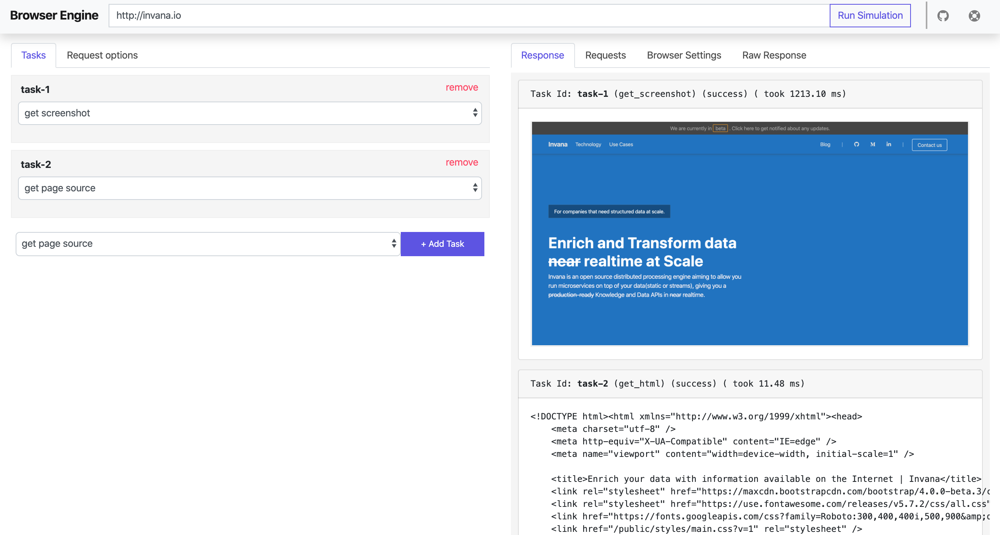
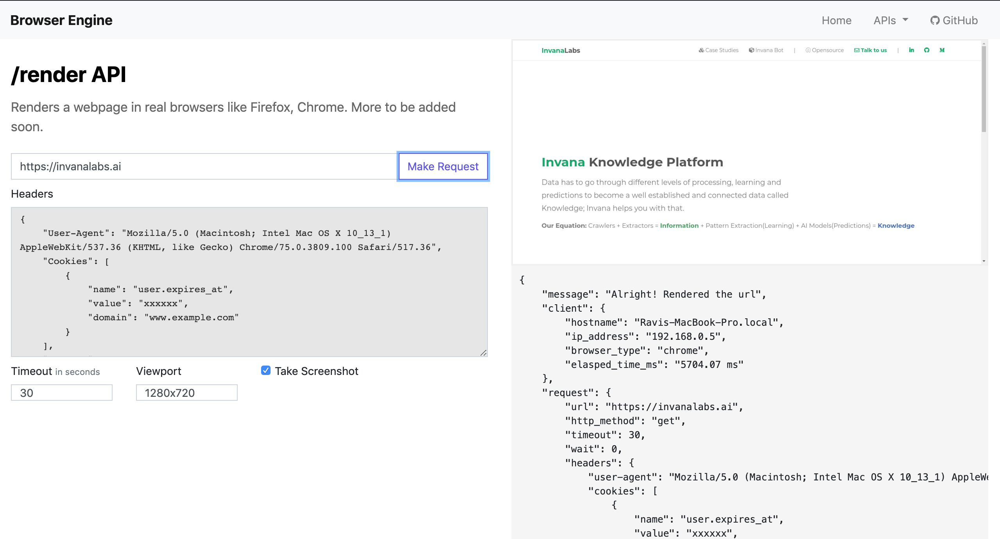

# Browser Engine

Web Automation and User behaviour simulations made easy with YAML configurations.

## Requirements

- Python 3.6
- Selenium webdriver


## Install via pip

```bash

## run selenium host
wget https://selenium-release.storage.googleapis.com/3.141/selenium-server-standalone-3.141.59.jar
java -jar selenium-server-standalone-3.141.59.jar # starts selenium webdriver at http://0.0.0.0:4444

## setup 
export SELENIUM_HOST=http://0.0.0.0:4444 # selenium host
export AUTH_TOKEN=iamlazydeveloper

# install browser engine via pip
pip install -e git+https://github.com/crawlerflow/browser-engine.git#egg=browser_engine

# starting the server 
uwsgi --socket 0.0.0.0:5000 --protocol=http -w browser_engine.server.wsgi:application --processes 4 --threads 2


```


## Install as Dockerized Application

```bash

# 1. start a selenium docker
docker run --name selenium -d -p 4444:4444 --shm-size=1g selenium/standalone-chrome:3.141.59-titanium


# 2. Deploying a browser engine container
git clone git@github.com:crawlerflow/browser-engine.git
docker build -t browser-engine --build-arg selenium_host="http://xxx.xx.xx.xx:4444" --build-arg auth_token="iamlazydeveloper" -f Dockerfile .
docker run  --name browser-engine -d -p 5000:5000 browser-engine 
```

## Screenshots

##### Homepage 


##### Render API



 
